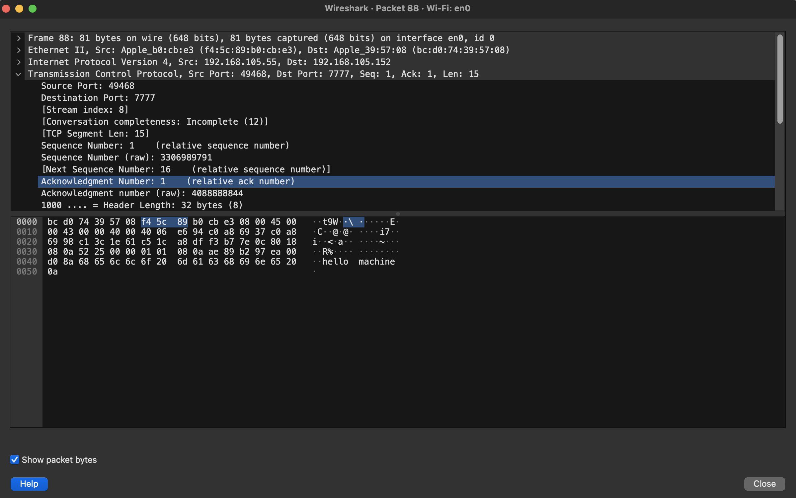
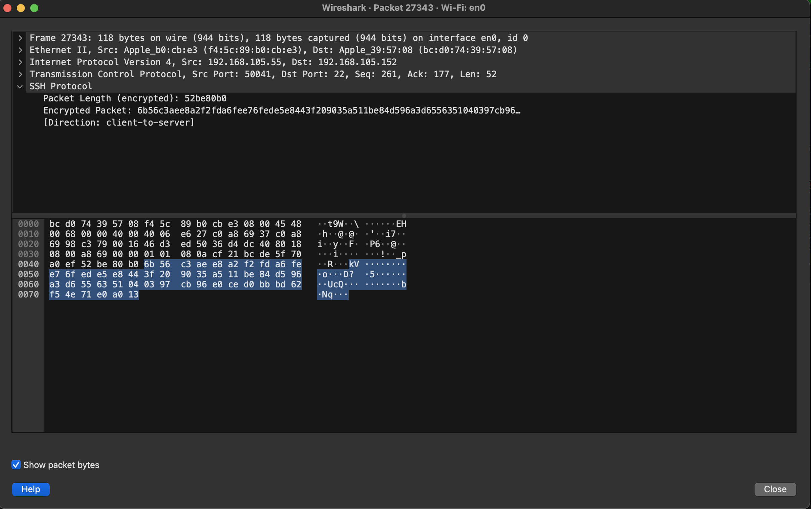

# A Networking Date

For many, a good weekend means: rest, some adventure and family time. My adventure over the weekend was some naive chat system using Netcat (nc) and ssh. Netcat is a popular unix network tool. It is commonly used for port scanning.

The goal was to set up a naive communication tunnel between two computers.

Note: this was tested only on MacBooks, macOS. Linux operating systems come with Netcat but the flags might be slightly different. I do not know if Windows come with Netcat but it is contained in [cygwin](https://cygwin.com/index.html), provides core *nix packages on Windows. Booting into Ubuntu on WSL should also make it available. Windows users can recreate this on their platform however they see fit.

## Netcat

According to macOS manual page, Netcat, nc - arbitrary TCP and UDP connections and listens. This means that `nc` can set up a TCP or UDP connection or listen for a connection on a port. I am interested in a TCP port.

### Setting up a TCP connection using Netcat

Open the terminal and enter this command: `nc -l <port>` \<port\> can be replaced with any port.

```bash
nc -l 7777
```

Netcat has set up a TCP connection listening on port 7777.

To join this connection, open another tab on the terminal and run:

```bash
nc localhost 7777
```

The connection should be fully set up. Both sides are able to send and receive messages from each other. Anything sent would be echoed on the receiving side.

Note: this connection can only be between two parties. At least, I could not make it work for more than two. Once a connection has been established no third client can join the connection. Even if a third nc client tries to join, it can neither receive nor send messages across the already existing connection. Any of the two parties involved in the connection can end the session. An interrupt signal would suffice to end it, Ctrl + C.

So far, we have achieved a simple TCP communication but cannot yet send messages across computers.

### Setting up a TCP connection across two computers using Netcat

Sending messages across terminal tabs on the same machine is good but nothing exciting.

Connect the two computers to a common network. An office WiFi or phone hotspot would suffice. That is, join the WiFi from the two computers.

#### <a name="find_ip"></a>Find IP addresses of the two computers

IP addresses of the computers would be needed since we are not messaging within `localhost` anymore.

You can find out your ip address using `ifconfig`. Usually, it is under the first ethernet network interface, i.e. en0. Look for inet and that is your ipv4 address.

I have a function in `.zshrc` that returns my ip each time I run the command.

```bash
ip_v4() {
    ifconfig | grep 'inet 192' | awk '{print $2}'
}
```

This snippet passes the output of ifconfig into `grep`. Grep is used to search for the pattern `inet 192` and the output is fed to `awk`. Awk would print the second column of the line passed to it. The output of `grep` would be a single line, that is why we did not specify line number in the `awk` script.

Note: `192` is my IP first octet and would vary for different networks. You can check under `en0` in the output of `ifconfig` to see yours.

By now you should have the IP addresses of the two computers ready.

#### Set up a connection over the network

For the sake of clarity we will refer to the computer that will listen at a TCP port as **PC1**. This is the computer where you will command Netcat to open a TCP port and listen for connection. This is supposedly the computer we have been using thus far. The second computer to join the connection would be called **PC2**.

Let us begin by doing the following on **PC1**:

1. Stop any nc connection still running, Ctrl + C would do the job
2. Open the terminal and run `nc -l 7777`. This immediately starts listening on TCP port 7777

Grab **PC2** and run: `nc pc1_ip_address 7777`. Replace `ip_address` with the IP address of PC1. See [Find IP above](#find_ip).

This should establish a TCP connection between the two computers and messages can now be sent across.

*PC 1*
  

*PC 2*


🎉

I even sent across the screenshot I took on PC2 to PC1 with a slight modification of the commands.
On PC2:

```bash
nc -l 7777 < screenshot.png
```

On PC1:

```bash
nc pc2_ip_address 7777 > pic.png
```

This uses *nix input redirection `<` to send in the file as STDIN and does the opposite to receive the file.

I tried it several times and it behaved pretty much the same way, just works. I captured and inspected the packets using [wireshark](https://www.wireshark.org/).



If I am able to capture and read the messages, so is the sysadmin guy, if I were in an office. Therefore, there is need to make this channel secured!

### Setting up a secured connection

1. This step is optional for those that already have an existing ssh key. If you do not have one or wish to generate another key, run this on PC1:

```bash
ssh-keygen -t rsa
```

2. Copy the ssh public key generated on PC 1 into PC 2. ssh keys are usually in `$HOME/.ssh` directory. I did this by manually sending the public key file via TCP connection. There are other conventional ways, like ssh-copy-id.

    Sending public key via TCP connection:
      i. On PC1 send in the public key file: `nc -l 7777 < ~/.ssh/test_key.pub`
      ii. On PC2 read the public key into file: `nc pc1_ip_address 7777 > test_key.pub`

3. On PC2 append the public key to the ssh authorized keys. `cat test_key.pub >> ~/.ssh/authorized_key`

4. Go back to PC1 and set up SSH tunneling through a port, `ssh -L 7777:localhost:7777 PC2_UserName@pc2_ip_address -N`. Replace `pc2_ip_address` and `PC2_UserName` (username on PC2). If unsure about the username, check:  `whomai` on PC2.

I ran this on PC1 to set up an ssh tunnel:

```bash
ssh -i ~/.ssh/test_key -L 7777:localhost:7777 echelon@192.168.105.152 -N
```

This should set up an ssh tunnel on PC1 localhost port 7777 to PC2 (192.168.105.152) on port 7777.

It is good to end all previous nc sessions. With a secured tunnel, start a TCP port listener on PC2.

```bash
nc -l 7777
```

Join the connection on PC1:

```bash
nc localhost 7777
```

Messages sent across should now be encrypted and not readable. I captured network packets with Wireshark, inspected them and it was all gibberish as expected.

Captured packets:


Goal achieved! Messages can be sent across a secured tunnel to a second computer 🥳

#### Bonus

Obviously, there are so many limitations to using this as a messaging system but I have found it very handy so far. To share texs or files on the two computers I would usually use email, Slack or Google Keep. 

Nonetheless, one limitation that I would like to quickly address is that the currenct public key added to authorized_keys can pretty much do anything on the second computer. It can even `rm -rf ~/*`.

To limit the commands PC1 can perform on PC2 with the public key added to `authorized_keys` open `authorized_keys` on PC2.

```bash
nano ~/.ssh/authorized_keys
```

Append this before the public key you previously added:

```text
command="date",no-pty,no-agent-forwarding,no-X11-forwarding ssh-rsa [public key]
```

[public key] is where the public key begins. This means that whenever PC1 connects to PC2 the `date` command would be run, no pseudo terminal is given to PC1, no further ssh forwarding can take place from PC2, no graphical window can be opened on PC2. This command can be modified to log to a file.

IBM has a good [manual](https://www.ibm.com/docs/en/zos/3.1.0?topic=daemon-format-authorized-keys-file) on authorized_keys config.

*nix systems are great for tiny experiments like this. I was able to appreciate more common programmes like: `openssl`, `awk`, `nc` and `wireshark`.
