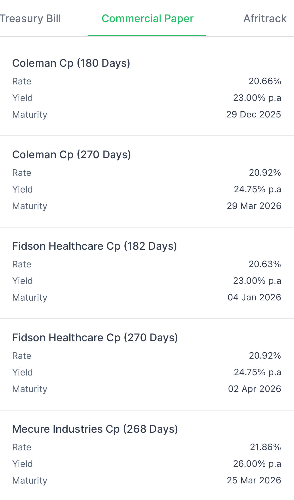

# Why Nigerian Companies Are Ditching Bank Loans for CPs

If you've been following the Nigerian business scene, you've probably noticed companies are getting creative with how they raise money. It’s not just for fun; the Central Bank of Nigeria (CBN) has made the usual route—bank loans—a tough and expensive puzzle to solve. When things get difficult, you start looking for a fix.

The culprits are two key instruments from the CBN's toolkit: the Monetary Policy Rate (MPR) and the Cash Reserve Ratio (CRR). Think of the **MPR** as the base interest rate the CBN charges banks. Currently, it's at a staggering 27.5%. This high rate means banks have to charge businesses a lot more for loans. The second tool, the **CRR**, forces banks to park a massive 50% of all customer deposits with the CBN, leaving them with less cash to lend out in the first place.

Faced with this double whammy of expensive and scarce bank loans, what are companies to do? They're doing what any smart player would: finding an alternative. We're now seeing a huge shift towards **Commercial Papers (CPs)**.

A CP is basically an IOU. A company issues this short-term debt note directly to investors, bypassing banks entirely. It's often a cheaper and faster way to get cash for things like working capital. Major companies are increasingly using this method to navigate the tight credit environment.

## Summary

In summary, the CBN's high MPR and CRR rates have created a problem for corporate financing. The private sector's solution has been a pivot to the CP market. This is making the debt market more dynamic, but it also raises the question of what happens when all this short-term debt needs to be repaid. It’s a trend worth watching.
